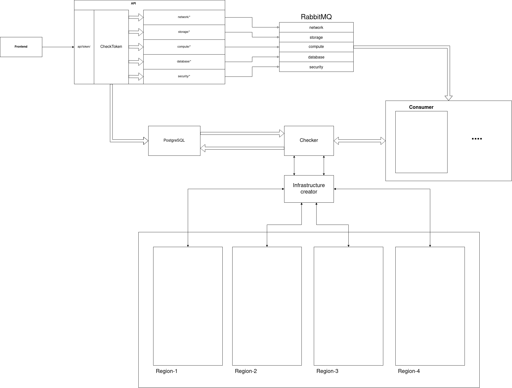

# System Design Belgeler

System design, bir yazılım veya donanım sistemini tasarlamak için kullanılan bir yaklaşımdır. Bu yaklaşım, bir sistemin gereksinimlerini, işlevlerini, performansını, güvenilirliğini, ölçeklenebilirliğini, güvenliğini ve diğer özelliklerini belirlemeyi ve tasarlamayı içerir.

System design, bir sistem mimarisinin oluşturulmasını içerir. Bu, sistem bileşenlerinin belirlenmesi, bileşenler arasındaki ilişkilerin belirlenmesi, arayüzlerin belirlenmesi ve sistem bileşenlerinin nasıl bir arada çalışacağının belirlenmesini içerir.

Bir sistem tasarımı yapılırken, aşağıdaki faktörler dikkate alınır:

 - **Gereksinimler**: Sistem tasarımı, sistemin ne yapması gerektiğini belirleyen gereksinimleri belirlemekle başlar.
 - **Performans**: Bir sistemin performansı, sistemin nasıl çalıştığı, işleme hızı, verimlilik ve yanıt süresi gibi faktörlere bağlıdır.
 - **Ölçeklenebilirlik**: Sistem tasarımı, sistemin büyüdüğünde nasıl ölçekleneceğini ve daha fazla işlemi nasıl destekleyeceğini belirler.
 - **Güvenilirlik**: Bir sistem tasarımı, sistemin ne kadar güvenilir olduğunu ve sistemdeki bileşenler arasındaki hatanın nasıl ele alınacağını belirler.
 - **Güvenlik**: Sistem tasarımı, sistemin ne kadar güvenli olduğunu ve güvenliği nasıl sağlayacağını belirler.
 - **Arayüzler**: Sistem tasarımı, sistem bileşenleri arasındaki arayüzleri belirler.

System design, bir sistem tasarımı oluşturmak için kullanılan yöntemlerin ve araçların kullanımını içerir. 
Bu araçlar,
 - veri modelleme,
 - tasarım şablonları,
 - sınıflandırma şemaları,
ve daha fazlasını içerir.

Sonuç olarak, system design, bir yazılım veya donanım sisteminin tasarımını yapmak için kullanılan bir yaklaşımdır ve sistemin gereksinimleri, performansı, ölçeklenebilirliği, güvenilirliği, güvenliği ve diğer özellikleri belirler.

### Örnek System Design

